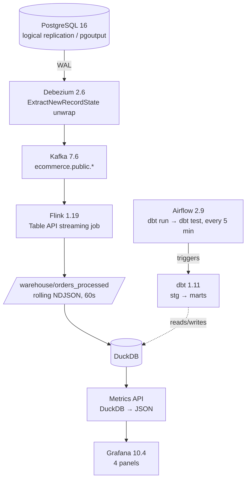

# Real-Time CDC Pipeline

Change data capture from a PostgreSQL write-ahead log into an analytical warehouse, with stream processing, a dbt transformation layer, orchestration, and dashboards. Runs locally on Docker Compose; the cloud target is provisioned with Terraform.

**Status:** self-built portfolio project. It runs end to end on one machine at single parallelism. It has not been operated in production or under sustained load — see [Limits](#limits).

---

## The problem

An operational Postgres database serves order traffic. Analysts need current order state, revenue and cancellation rates, but querying the operational database directly is unsafe under load and the queries are the wrong shape for it. Periodic batch extracts either miss updates or re-scan the whole table.

CDC solves this by reading the database's own replication stream. Every INSERT, UPDATE and DELETE becomes an event, so the analytical copy stays current without the source database ever serving an analytical query.

---

## Architecture



**Why these pieces.** Debezium reads the WAL rather than polling, so updates and deletes are captured, not just inserts. The `ExtractNewRecordState` transform unwraps Debezium's before/after envelope and adds `__op`, `__table` and `__ts_ms` as top-level fields, which is what lets the Flink schema stay flat. Flink filters out the initial snapshot reads (`__op = 'r'`) and maps operation codes to readable strings before writing rolling NDJSON files. DuckDB reads those files directly with a glob, so there is no loader process to maintain. dbt does the deduplication — `fct_orders` keeps the latest event per `order_id` by `processed_at` — which keeps the streaming layer stateless and the correctness logic in testable SQL.

---

## Stack

| Layer | Technology | Version |
|---|---|---|
| Source database | PostgreSQL | 16 |
| CDC capture | Debezium | 2.6 |
| Event streaming | Apache Kafka (Confluent) | 7.6 |
| Stream processing | Apache Flink (PyFlink Table API) | 1.19 |
| Warehouse | DuckDB | 1.x |
| Transformation | dbt Core | 1.11 |
| Orchestration | Apache Airflow | 2.9 |
| Dashboards | Grafana | 10.4 |
| Cloud IaC | Terraform | ≥ 1.5 |
| Runtime | Docker Compose (12 services) | v2 |

---

## What is actually built

| Component | State |
|---|---|
| Debezium connector for `orders`, `customers`, `products` | Configured and registered |
| Flink streaming job | Implemented. Consumes `ecommerce.public.orders` only |
| dbt models | 3: `stg_orders`, `fct_orders`, `fct_order_metrics` |
| dbt tests | 10 declared (`not_null`, `unique`, `accepted_values`) across `stg_orders` and `fct_orders` |
| Airflow DAG | `dbt_ecommerce_pipeline` — `dbt_run >> dbt_test`, every 5 min, 2 retries with exponential backoff |
| Grafana dashboard | 4 panels: orders by status, gross revenue by hour, order volume by hour, cancellation rate |
| Terraform (GCP) | Cloud SQL, GCS data lake, BigQuery dataset + 2 tables, VPC/subnet/firewall, service account with scoped IAM |
| Order simulator | Generates continuous order traffic to drive the pipeline |

**Known gaps, deliberately listed:**

- `customers` and `products` are captured into Kafka but not consumed downstream. Only the `orders` topic is processed.
- `fct_order_metrics` has no tests and no `schema.yml` entry.
- Terraform provisions the cloud *targets*. It does not deploy Kafka, Debezium or Flink to GCP, and `dbt/profiles.yml` has only a DuckDB output — there is no BigQuery target yet. The cloud path is provisioned, not wired.
- Flink runs at `parallelism = 1` with 30-second exactly-once checkpointing. Correct for a single-node demo; not a throughput claim.

---

## Run it

**Prerequisites:** Docker Desktop 24+, Docker Compose v2.

```bash
git clone https://github.com/sarahbouden/realtime-cdc-pipeline.git
cd realtime-cdc-pipeline

cp .env.example .env          # defaults work as-is for local
docker compose up --build     # 12 services

bash scripts/register-debezium.sh    # register the CDC connector
bash scripts/submit-flink-job.sh     # submit the streaming job
```

Verify events are flowing:

```bash
docker exec -it cdc_kafka kafka-console-consumer \
  --bootstrap-server localhost:9092 \
  --topic ecommerce.public.orders \
  --from-beginning --max-messages 5
```

Query the warehouse:

```bash
docker exec -it cdc_dbt python3 -c "
import duckdb
con = duckdb.connect('/warehouse/ecommerce.duckdb')
print(con.execute('SELECT status, COUNT(*) AS orders, ROUND(SUM(total_amount),2) AS revenue FROM fct_orders GROUP BY status ORDER BY orders DESC').df())
"
```

| Service | URL |
|---|---|
| Flink Web UI | http://localhost:8082 |
| Airflow | http://localhost:8080 |
| Grafana | http://localhost:3000 (admin/admin) |
| Kafka Connect | http://localhost:8083 |
| Schema Registry | http://localhost:8081 |
| Metrics API | http://localhost:3001 |

---

## Cloud target (Terraform)

`terraform/` provisions the GCP side: Cloud SQL Postgres 16 with logical replication, a GCS data lake bucket, a BigQuery dataset with `fct_orders` and `fct_order_metrics`, a VPC with private subnet and firewall rules, and a service account with scoped IAM bindings. Region `europe-west9`.

```bash
cd terraform/
cp terraform.tfvars.example terraform.tfvars
terraform init && terraform plan
```

This is infrastructure definition only. Migrating the streaming layer and adding a BigQuery dbt target are the next steps, not done.

---

## Limits

Single-node, single-parallelism, synthetic traffic from a local generator. No schema-evolution handling, no dead-letter path, no backfill strategy, no alerting. Credentials in `debezium/register-connector.json` are local development values committed on purpose; a real deployment would source them from a secret store.
